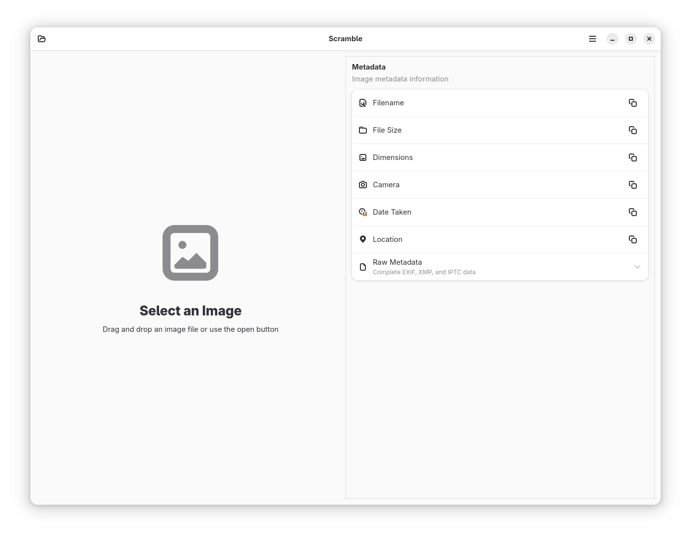

# Scramble

Remove metadata from your images.

<div align="center">



<a href="https://flathub.org/apps/io.github.tobagin.scramble"></a>
<a href="https://ko-fi.com/tobagin"></a>

</div>

## 🎉 Version 1.4.1 - Latest Release

**Scramble 1.4.1** brings metadata improvements and documentation updates.

### 🆕 What's New in 1.4.1

- **Metadata Improvements**: Better branding and store presence.
- **Documentation**: Improved README and asset updates.

### 🆕 What's New in 1.4.0

- **Select What to Remove**: Choose between removing GPS, Camera details, Dates, Software info, or Author data.
- **New Preferences**: Manage removal settings in the new Preferences window.
- **New Icons**: Fresh look with updated application icons.

For detailed release notes, see [CHANGELOG.md](CHANGELOG.md).

## Features

- **Inspect Metadata**: See exactly what information is hidden in your files (EXIF, IPTC, XMP).
- **Clean Images**: Remove metadata to protect your privacy before sharing.
- **Easy to Use**: Just drag and drop your images.
- **Safe**: Your original files are never touched. Scramble always saves a new copy.
- **Offline**: No internet connection required. Your photos stay on your computer.

### Supports

- **Read & Clean**: JPEG, PNG, WebP
- **Convert & Clean**: TIFF, HEIF, HEIC (converted to PNG)

## Building from source

```bash
# Install dependencies
flatpak remote-add --if-not-exists flathub https://flathub.org/repo/flathub.flatpakrepo

# Build and install
./scripts/build.sh --dev
```

## Usage

### Basic Usage

1. **Open an image**: Drag & drop, click Open, or press `Ctrl+O`
2. **View metadata**: Inspect EXIF/IPTC/XMP data in the right panel
3. **Configure removal**: Open Preferences (`Ctrl+,`) → Metadata Removal
4. **Save clean copy**: Press `Ctrl+S` or click "Save Clean Copy"

### Keyboard Shortcuts

| Action | Shortcut |
|--------|----------|
| Open image | `Ctrl+O` |
| Save clean copy | `Ctrl+S` |
| Compare before/after | `Ctrl+R` |
| Batch process | `Ctrl+B` |
| Export metadata | `Ctrl+E` |
| Clear image | `Ctrl+Shift+C` |
| Preferences | `Ctrl+,` |
| Quit | `Ctrl+Q` |

## Architecture

- **Language**: Vala with GTK4/LibAdwaita
- **UI Definition**: Blueprint markup language
- **Build System**: Meson with Flatpak packaging
- **Metadata Engine**: GExiv2 with BMFF support

## Contributing

1. Fork the repository
2. Create a feature branch
3. Test thoroughly with `./scripts/build.sh --dev`
4. Submit a pull request

## License

GPL-3.0-or-later. See [LICENSE](LICENSE) for details.

## Support

- **Bug Reports**: [GitHub Issues](https://github.com/tobagin/scramble/issues)
- **Feature Requests**: [GitHub Discussions](https://github.com/tobagin/scramble/discussions)

## Acknowledgments

- Built with [GTK4](https://www.gtk.org/) and [LibAdwaita](https://gnome.pages.gitlab.gnome.org/libadwaita/)
- Metadata handling by [GExiv2](https://gitlab.gnome.org/GNOME/gexiv2)
- UI defined with [Blueprint](https://jwestman.pages.gitlab.gnome.org/blueprint-compiler/)
