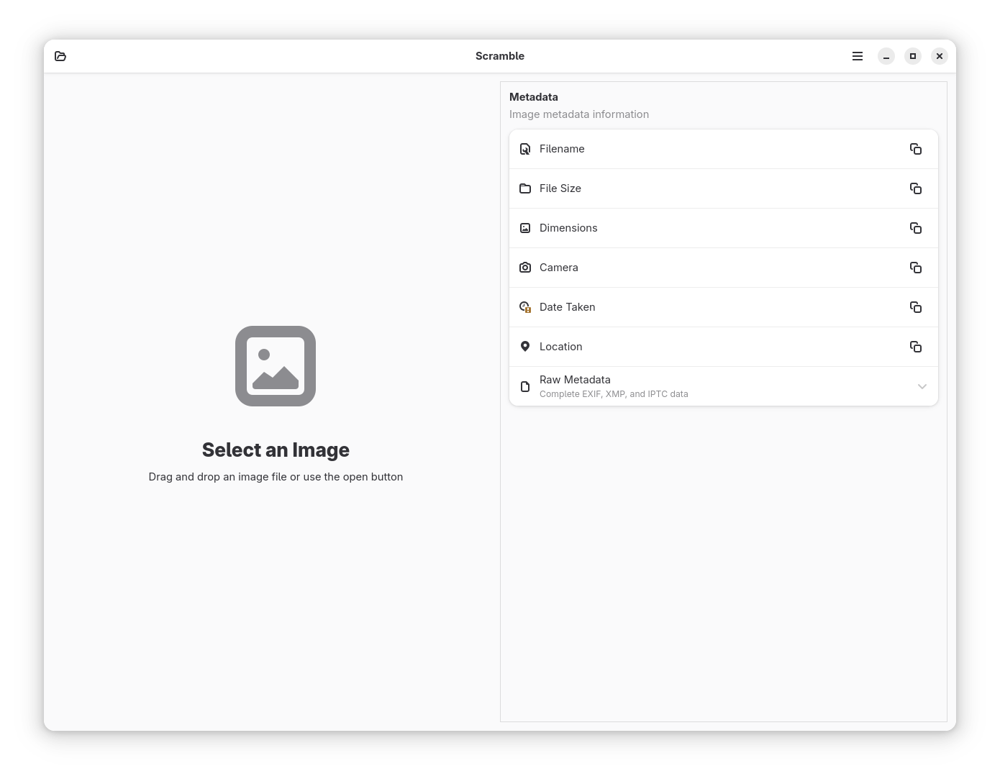

# Scramble

**Privacy-focused image metadata removal tool**

Scramble is a modern, privacy-focused utility for viewing and removing metadata from images. Built with GTK4 and LibAdwaita, it provides a clean, intuitive interface with a responsive 50/50 layout for efficient metadata inspection and removal.



## Features

- **Comprehensive Metadata Inspection**: View detailed image metadata (EXIF, IPTC, XMP) with organized display and expandable raw metadata view
- **One-Click Metadata Removal**: Remove all metadata while preserving image quality
- **Batch Processing**: Process multiple images at once with progress tracking and detailed reports
- **Before/After Comparison**: Side-by-side comparison view to preview changes before saving
- **Metadata Export**: Export metadata to JSON or CSV for analysis and documentation
- **Modern Interface**: Clean GTK4/LibAdwaita design with header bar integration and context-sensitive controls
- **Drag-and-Drop Support**: Simply drag images into the application or use the open button
- **Keyboard Shortcuts**: Full keyboard navigation with comprehensive shortcuts for all actions
- **Non-Destructive Workflow**: Original files are never modified
- **Privacy-First Design**: Completely offline operation with no data collection
- **Multiple Format Support**: Read HEIF/HEIC/TIFF/WebP, output to JPEG/PNG/WebP
- **Version Updates**: Automatic "What's New" dialog with release notes


## Screenshots

| Main Interface | Metadata View | Clean Result |
|---|---|---|
|  |  |  |

## Requirements

- GNOME 45+ runtime
- Vala compiler (for building from source)
- GTK4 and LibAdwaita
- GExiv2 library for metadata handling (with BMFF support for HEIF/HEIC)
- Flatpak for packaging

## Building

The application uses a streamlined build system with automatic installation:

### Development Build

```bash
./build.sh --dev
```

### Production Build

```bash
./build.sh
```

The build script automatically:
- Builds the Flatpak package
- Installs it locally
- Makes it ready to run

## Installation

### From Source

1. Install dependencies:
   ```bash
   # On Fedora/RHEL
   sudo dnf install flatpak flatpak-builder vala meson

   # On Ubuntu/Debian
   sudo apt install flatpak flatpak-builder valac meson
   ```

2. Add Flathub repository:
   ```bash
   flatpak remote-add --if-not-exists flathub https://flathub.org/repo/flathub.flatpakrepo
   ```

3. Build and install:
   ```bash
   ./build.sh --dev
   ```

### From Flathub

*Coming soon - application will be available on Flathub after initial release*

## Usage

1. **Launch Scramble** from your application launcher or run:
   ```bash
   flatpak run io.github.tobagin.scramble
   ```

2. **Load an image**:
   - Drag and drop it into the application window, or
   - Click the "Open" button in the header bar, or
   - Use Ctrl+O keyboard shortcut

3. **View metadata** in the right panel:
   - Organized display of common metadata fields
   - Expandable "Raw Metadata" section for complete EXIF/XMP data
   - Click copy buttons to copy individual values

4. **Remove metadata**:
   - Click "Save Clean Copy" in the header bar, or
   - Use Ctrl+S keyboard shortcut
   - Choose save location for the cleaned image

5. **Clear current image**: Use Ctrl+Shift+C or the clear button to start over

## Keyboard Shortcuts

| Action | Shortcut |
|--------|----------|
| Open image | Ctrl+O |
| Save clean copy | Ctrl+S |
| Compare before/after | Ctrl+R |
| Batch process | Ctrl+B |
| Export metadata | Ctrl+E |
| Clear current image | Ctrl+Shift+C |
| Preferences | Ctrl+, |
| Keyboard shortcuts | Ctrl+? |
| Quit | Ctrl+Q |

## Supported Formats

### Input Formats (Read & Clean)
- **JPEG** (.jpg, .jpeg) - Full EXIF, IPTC, XMP support
- **PNG** (.png) - Text metadata and color profile support
- **TIFF** (.tiff, .tif) - Complete metadata support
- **WebP** (.webp) - EXIF and XMP support
- **HEIF** (.heif) - Full EXIF, IPTC, XMP support with modern compression
- **HEIC** (.heic) - Apple's HEIF implementation with complete metadata support

### Output Formats (Save Clean)
- **JPEG** - High quality (95%) compression
- **PNG** - Lossless compression
- **WebP** - High quality (95%) compression with modern efficiency

**Note**: Due to GdkPixbuf limitations with the portal file API:
- HEIF/HEIC files are converted to JPEG, PNG, or WebP
- TIFF files requested for output are automatically converted to PNG (lossless)

This ensures maximum compatibility while preserving image quality across all platforms.

## Privacy & Security

Scramble is designed with privacy as the top priority:

- **No Network Access**: Completely offline operation with no network permission
- **No Data Collection**: Zero telemetry or analytics
- **Sandboxed**: Runs in a secure Flatpak environment
- **Non-Destructive**: Original files are never modified
- **Secure Memory**: Image data is properly cleaned from memory after processing
- **Minimal Permissions**: Only requires access to user image directories
- **Format Validation**: Magic number checking prevents processing of malicious files with fake extensions
- **Symlink Protection**: Security measures to prevent TOCTOU attacks
- **Safe Error Handling**: Error messages don't expose sensitive system paths

## Architecture

The application is built with modern GNOME technologies:

- **Language**: Vala with GTK4/LibAdwaita
- **UI Definition**: Blueprint markup language (.blp files)
- **Build System**: Meson with Flatpak packaging
- **Metadata Engine**: GExiv2 library with BMFF support for comprehensive HEIF/HEIC format support
- **Image Processing**: GdkPixbuf for loading and metadata stripping

## Development

### Project Structure

```
├── src/                    # Vala source files
│   ├── main.vala          # Application entry point
│   ├── window.vala        # Main window implementation
│   ├── metadata_row.vala  # Metadata display widget
│   ├── about-dialog.vala  # About dialog with release notes
│   └── preferences_dialog.vala # Settings dialog
├── data/
│   ├── ui/                # Blueprint UI definitions
│   ├── screenshots/       # Application screenshots
│   └── icons/            # Application icons (PNG format)
├── packaging/            # Flatpak manifests
└── po/                   # Internationalization
```

### Building for Development

The development build uses a local source mount for rapid iteration:

```bash
./build.sh --dev
```

This creates `io.github.tobagin.scramble.Devel` with the development app ID.

## Contributing

1. Fork the repository
2. Create a feature branch
3. Make your changes following the existing Vala/GTK patterns
4. Test thoroughly with the development build
5. Submit a pull request

Please ensure your code follows GNOME coding standards and includes appropriate comments.

## License

This project is licensed under the GPL-3.0-or-later license. See the LICENSE file for details.

## Support

- **Bug Reports**: [GitHub Issues](https://github.com/tobagin/scramble/issues)
- **Feature Requests**: [GitHub Discussions](https://github.com/tobagin/scramble/discussions)
- **Documentation**: [Project Wiki](https://github.com/tobagin/scramble/wiki)

## Acknowledgments

- Built with [GTK4](https://www.gtk.org/) and [LibAdwaita](https://gnome.pages.gitlab.gnome.org/libadwaita/)
- Uses [Blueprint](https://jwestman.pages.gitlab.gnome.org/blueprint-compiler/) for modern UI definition
- Metadata handling powered by [GExiv2](https://gitlab.gnome.org/GNOME/gexiv2)
- Distributed via [Flatpak](https://flatpak.org/) for security and portability
- Icons and design following [GNOME Human Interface Guidelines](https://developer.gnome.org/hig/)